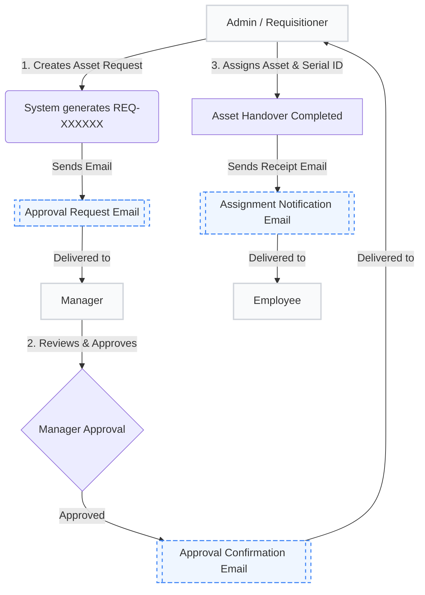

# IT Asset Management System: Email & Notification Workflow Manual

This user manual outlines the automated email generation and merge workflow built into the **SPFx Asset Management Portal**. 

---

## 1. Workflow Architecture & Roles

The system orchestrates notifications between three primary roles to ensure asset requests are tracked from initiation to physical device handovers.



### Roles Breakdown:
* **Admin (IT Helpdesk / Operations)**: Creates requests on behalf of employees, receives approval confirmations, and updates device hardware records (assigning serial numbers).
* **Manager (Approver)**: Receives notifications to review pending requests and approves/denies them in the portal.
* **Employee (End User)**: The recipient of the assigned IT asset, who receives the final device handover receipt.

---

## 2. Notification Triggers & Templates

Each phase of the lifecycle triggers a specific email template designed with a premium, responsive HTML interface.

### Email Trigger Matrix

| Stage | Trigger Event | Sender API | Recipient | Key Variables Merged |
| :--- | :--- | :--- | :--- | :--- |
| **1. Approval Request** | Admin registers an asset request for an employee. | Graph API / SP Utility | **Manager** (dynamically resolved) | Employee Name, Requested Asset, Request ID, Request Date, Admin Name |
| **2. Request Approved** | Manager approves request via Portal. | Graph API / SP Utility | **Admins** (Kiran / Akhila) | Request ID, Employee Name, Asset Name, Approved By, Approval Date |
| **3. Asset Assigned** | Admin links serial number & assigns to employee. | Graph API / SP Utility | **Employee** | Employee Name, Asset Name, Serial/Asset ID, Assigned By, Assignment Date |

---

## 3. Detailed Templates Overview

### Template A: Approval Request (To Manager)
* **Goal**: Alerts the manager that action is required.
* **Visual Theme**: Premium Blue header (`#2563eb`) with a summary table.
* **Sample Content**:
  > Hello,
  > A new asset request has been created and requires your review and approval.
  > * **Employee Name**: Jane Doe
  > * **Requested Asset**: MacBook Pro 16"
  > * **Request ID**: `REQ-000104`
  > * **Status**: Pending Approval

---

### Template B: Request Approved (To Admins)
* **Goal**: Alerts the IT team that they have authorization to allocate a physical device.
* **Visual Theme**: Success Green header (`#10b981`).
* **Sample Content**:
  > Hello Admin,
  > The following asset request has been approved by the manager. Please proceed to allocate the asset to the employee in the Admin panel.
  > * **Request ID**: `REQ-000104`
  > * **Employee Name**: Jane Doe
  > * **Approved By**: Manager Name

---

### Template C: Asset Assigned (To Employee)
* **Goal**: Serves as a digital handover receipt with device specifications.
* **Visual Theme**: Corporate Sky Blue header (`#0284c7`).
* **Sample Content**:
  > Dear Jane Doe,
  > Your requested asset has been assigned to you. Here are the assignment details:
  > * **Asset Name**: MacBook Pro 16"
  > * **Asset ID / Serial**: `C02YT123LVDD`
  > * **Assigned By**: Admin Name
  > * **Assignment Date**: 10/08/2026

---

## 4. Technical Integration & Fallback Mechanisms

To ensure high availability and ease of developer debugging, the system is designed with multiple fail-safes.

### 1. Delivery Channels
1. **Microsoft Graph API (`/me/sendMail`)**: First choice. Enables sending notifications to external recipients (e.g., `nexergroup.com`).
2. **SharePoint Utility (`sp.utility.sendEmail`)**: Fallback channel if Microsoft Graph permissions are not active or consent is pending.
3. **Developer Outbox Logging**: If both channels fail (such as on developer local host machines without Exchange setups), the system prints a styled mock email outbox block to the browser developer console:
   ```javascript
   console.log("%c📬 [EMAIL NOTIFICATION OUTBOX]...", "background: #1e3a8a; color: #ffffff; ...")
   ```
   A banner is also shown in the browser to notify developers that an email was triggered.

### 2. Recipient Resolution Logic
The manager's email address is resolved dynamically:
* **Step 1**: The system queries the `EmployeeList` in SharePoint, searching for the employee's name to find the associated manager's email.
* **Step 2**: If the list is absent or fails, the system calls the **SharePoint User Profile Service** (`ensureUser` -> `profiles.getPropertiesFor`) to fetch the employee's AD Manager profile and extract their `WorkEmail`.

> [!TIP]
> During development or staging, you can route all outbound emails to a test email account (e.g., `Akhila.Dodla@3bh3kf.onmicrosoft.com`) by toggling the `USE_MOCK_TEST_EMAILS` flag to `true` inside [EmailService.ts](file:///c:/Users/00325102/OneDrive%20-%20Nexer%20AB/Desktop/Emailmerge/src/webparts/inventoryManagement/services/EmailService.ts#L31).

---

## 5. Troubleshooting & Configuration

* **Emails are not sending**: Verify that the user has given permissions for the Microsoft Graph API Client in the SharePoint Online Admin Center under **API Access**.
* **Manager email defaults to DiegoS**: Check if the `USE_MOCK_TEST_EMAILS` setting is active in [EmailService.ts](file:///c:/Users/00325102/OneDrive%20-%20Nexer%20AB/Desktop/Emailmerge/src/webparts/inventoryManagement/services/EmailService.ts#L31). Set it to `false` for live directory resolution.
* **Missing Request ID / Keys**: In the SharePoint list, ensure the `RequestKey` column exists. The system will auto-provision missing columns, but list schema locks can sometimes prevent this.
